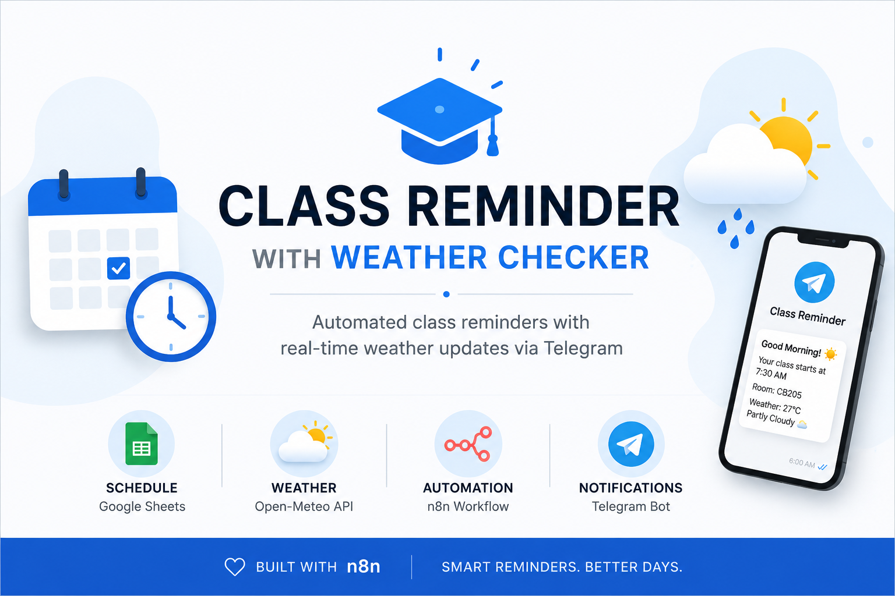

<p align="center">
  
</p>

## Workflow

```text
Schedule Trigger
      │
      ▼
Retrieve Today's Schedule (Google Sheets)
      │
      ▼
Filter Today's Classes
      │
      ▼
Check Reminder Time
      │
      ├── No ─────────────► End Workflow
      │
      ▼ Yes
Fetch Current Weather (Open-Meteo API)
      │
      ▼
Merge Schedule & Weather Data
      │
      ▼
Convert Weather Code to Readable Description
      │
      ▼
Generate Reminder Message
      │
      ▼
Send Notification via Telegram Bot
```
